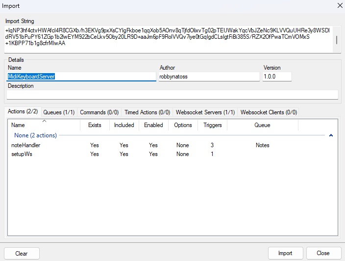
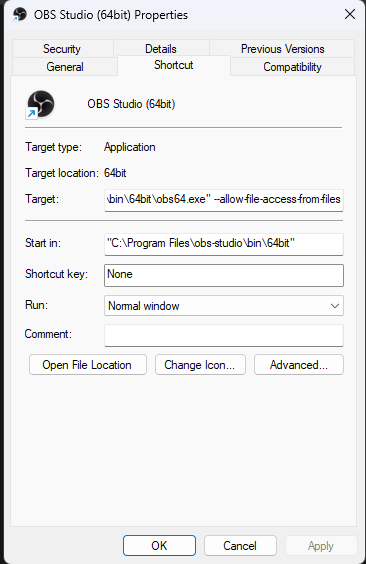
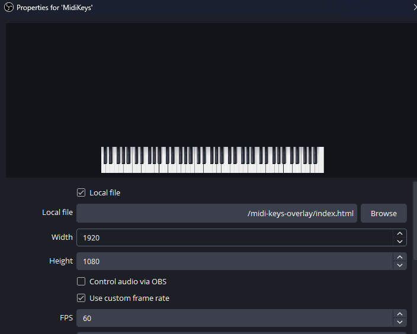

# MidiKeysOverlay

This is a Browser Source overlay which lets you display your Midi Keyboard on your stream in real time! 
It relies on Streamer Bot to handle the MIDI inputs and send websocket messages to the overlay. 
This could easily be replaced with a separate backend webserver if Streamer Bot doesn't meet your needs. 
For now this was most convenient option.

## Setup Steps

1. Import the MIDI handler into Streamer.Bot
* Find the file named "streamerbot_import_string.txt" and copy the import string
* Import it into Streamer Bot

2. Edit your OBS startup shortcut or script to allow CORS for local files. Add "--allow-file-access-from-files" flag after the Target of the shortcut

3. Create a browser source with the Overlay.
* Select a local file
* Set the Width to 1920 x 1080
* Select a framerate of 60 FPS
